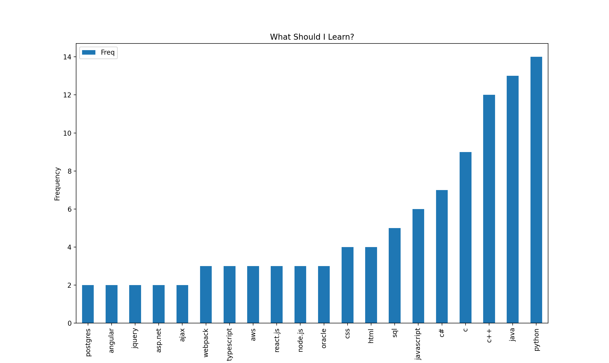

# python_projects

## guessingGame.py

* To run: python3 guessingGame.py num1 num2 (where num1 and num2 are the numbers you'll guess between inclusively)
* A binary search algorithm will also run to see who takes the least amount of tries to correctly guess the number.

## pdf_merge.py

* To run: python3 pdf_merge.py
* A lightweight pdf merger that creates an input folder for the files you want to merge. The files should be numbered if you want them merged in a particular order.

## passCheck.py

* To run: python3 passCheck.py
* Securely check if your password has appeared in a data breach.

## What To Learn
I wanted to see what the most popular programming languages and skills were, so I made a program that'd take in skills I found on LinkedIn Jobs and make a frequency graph. Next I want to add in web scraping.
* To run: python3 jobs.py
* Can take in a single input or a comma separated list
* Collected data from 30 different job postings

